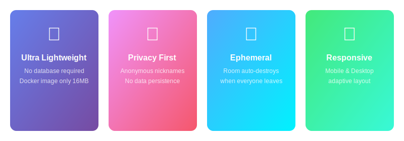

# MiniChat-Plus

An enhanced fork of [MiniChat](https://github.com/seeyousuperman/minichat) - Lightweight, anonymous, ephemeral chat tool built with Go.


[English](README.md) | [中文](README_CN.md) | [Changelog](CHANGELOG.md)

---

## Features



### Core

- **Zero Dependencies** - No database, no extra components, Docker image only 16MB
- **Ephemeral Rooms** - Data lives only in server memory, rooms destroyed when all users leave
- **Full Anonymity** - Just pick a nickname, no registration, no real info required
- **Room Password** - Optional password protection for private conversations
- **No History** - Late joiners cannot see previous messages

### Enhanced (Plus)

- Coming soon...

## Quick Start

> Only two steps:
> 1. You enter a URL, type a nickname, start chatting
> 2. Share the URL to a friend, they enter a nickname, start chatting

1. Open the app - a random room is created automatically
2. Enter any nickname, click to join
3. Share the room URL with your friends
4. Enjoy private, ephemeral chat
5. When everyone leaves, the room is immediately destroyed

## Deployment

### Docker Compose (Recommended)

```bash
mkdir minichat && cd minichat

# Create config
cat <<EOF > config.yaml
port: 8080
server_url: ""
EOF

# Download compose file
wget https://raw.githubusercontent.com/okhanyu/minichat/master/docker-compose.yml

# Start
docker-compose up -d
```

### Docker Run

```bash
docker pull okhanyu/minichat:latest
docker run -d --name minichat --restart always \
  -p 8080:8080 \
  -v ./config.yaml:/app/config.yaml \
  -e TEMPLATE_NAME="bulma" \
  okhanyu/minichat:latest
```

### Binary

1. Download the binary from [Releases](https://github.com/Tonyhzk/MiniChat-Plus/releases)
2. Place `config.yaml` in the same directory
3. Run the binary

## Configuration

| Field | Description | Default |
|-------|-------------|---------|
| `port` | Server port | `8080` |
| `server_url` | Backend API URL (leave empty if same domain) | `""` |

### Environment Variables

| Variable | Description | Options |
|----------|-------------|---------|
| `TEMPLATE_NAME` | UI template | `bulma` / `ddiu` |

## Tech Stack

| Category | Technology |
|----------|-----------|
| Backend | Go |
| Frontend | JavaScript, HTML, CSS |
| Protocol | WebSocket |
| Container | Docker |

## Acknowledgments

- [MiniChat](https://github.com/seeyousuperman/minichat) - Original project by seeyousuperman
- [ddiu8081](https://ddiu.io) - ddiu template author
- [@alanoy](https://ideapart.com) - bulma template author

## License

[Apache License 2.0](LICENSE)
