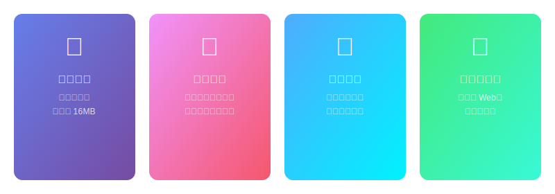

# MiniChat-Plus

基于 [MiniChat](https://github.com/seeyousuperman/minichat) 的增强版 - 轻量级、匿名、无痕、即用即销的聊天工具。


[English](README.md) | **中文** | [更新日志](CHANGELOG_CN.md)

---

## 功能特性



### 核心功能

- **零依赖** - 无需数据库、无多余组件，Docker 镜像仅 16MB
- **阅后即焚** - 数据仅在服务器内存中短暂中转，所有人离开后房间立即销毁
- **完全匿名** - 随意填写昵称即可，无需注册，无需任何真实信息
- **房间密码** - 可选密码保护，私密对话更安全
- **无历史记录** - 后进入房间的用户无法查看之前的消息

### 增强功能（Plus）

- 敬请期待...

## 快速开始

> 只需两步：
> 1. 你输入地址，填个昵称，开始聊天
> 2. 把地址分享给朋友，朋友填个昵称，开始聊天

1. 打开应用，自动创建一个随机房间
2. 输入任意昵称，点击进入房间
3. 将房间地址分享给朋友
4. 开始愉快且私密的聊天
5. 当所有人离开后，房间立即销毁

## 部署方式

### Docker Compose（推荐）

```bash
mkdir minichat && cd minichat

# 创建配置文件
cat <<EOF > config.yaml
port: 8080
server_url: ""
EOF

# 下载 compose 文件
wget https://raw.githubusercontent.com/okhanyu/minichat/master/docker-compose.yml

# 启动
docker-compose up -d
```

### Docker Run

```bash
docker pull okhanyu/minichat:latest
docker run -d --name minichat --restart always \
  -p 8080:8080 \
  -v ./config.yaml:/app/config.yaml \
  -e TEMPLATE_NAME="bulma" \
  okhanyu/minichat:latest
```

### 二进制运行

1. 从 [Releases](https://github.com/Tonyhzk/MiniChat-Plus/releases) 页面下载最新版本
2. 将 `config.yaml` 放在同一目录下
3. 双击运行可执行文件

## 配置说明

| 字段 | 说明 | 默认值 |
|------|------|--------|
| `port` | 服务端口 | `8080` |
| `server_url` | 后端 API 地址（同域名同端口时留空） | `""` |

### 环境变量

| 变量 | 说明 | 可选值 |
|------|------|--------|
| `TEMPLATE_NAME` | 页面模板 | `bulma` / `ddiu` |

## 技术栈

| 类别 | 技术 |
|------|------|
| 后端 | Go |
| 前端 | JavaScript, HTML, CSS |
| 通信协议 | WebSocket |
| 容器化 | Docker |

## 致谢

- [MiniChat](https://github.com/seeyousuperman/minichat) - 原项目，作者 seeyousuperman
- [ddiu8081](https://ddiu.io) - ddiu 模板作者
- [@alanoy](https://ideapart.com) - bulma 模板作者

## 许可证

[Apache License 2.0](LICENSE)
